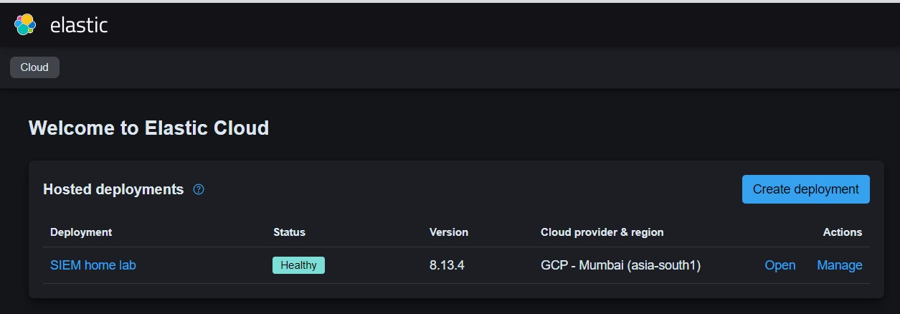
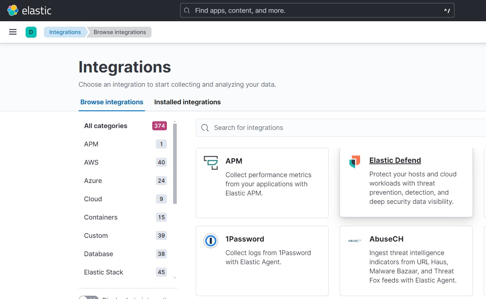
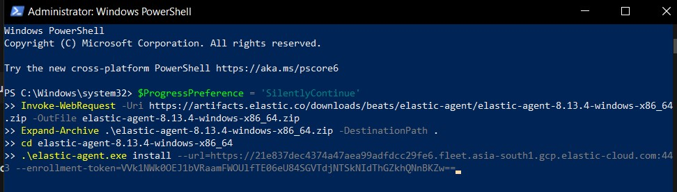
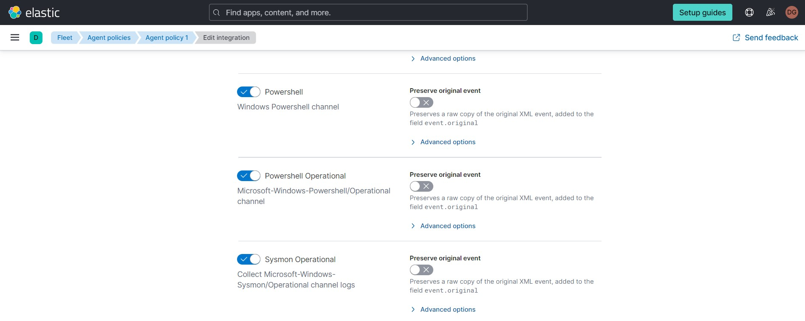
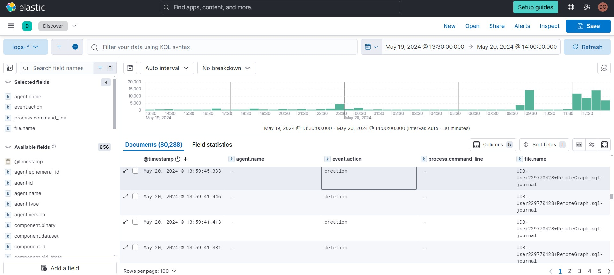
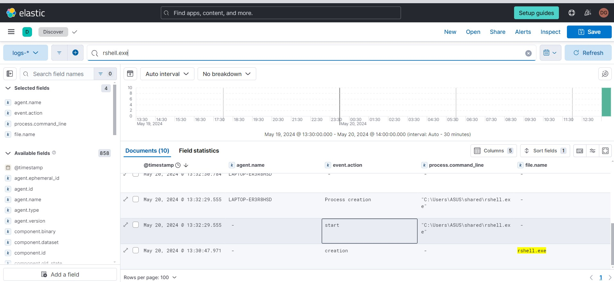
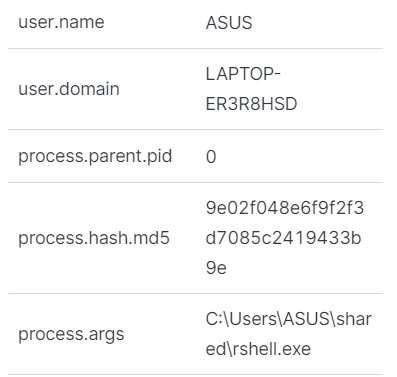
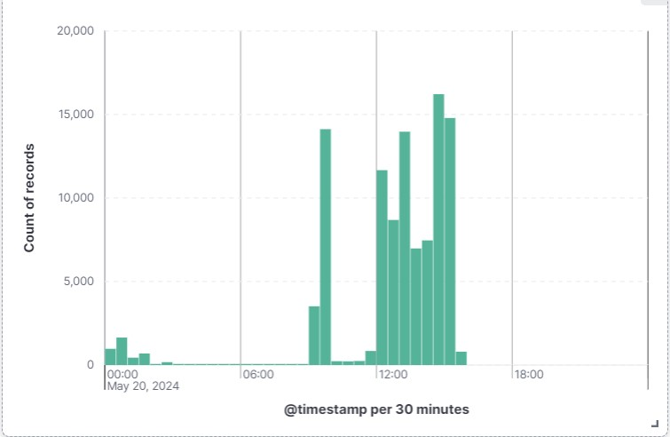
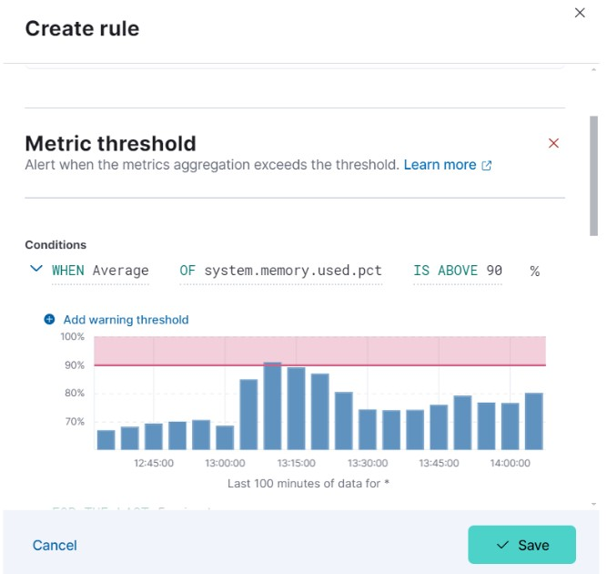

# SIEM Elastic Home Lab Documentation

## Description

This documentation outlines the setup and configuration of a home lab environment using Elasticsearch as the core component. Elasticsearch is a powerful search and analytics engine that offers real-time search and data analysis capabilities. This project serves as a demonstration of how to create and manage your own Elasticsearch instance at home, exploring its features, deploying practical use cases, and effectively monitoring your systems.

## Features of Elasticsearch

- **Full-Text Search**: Fast and accurate full-text search capabilities.
- **Real-Time Analytics**: Analyze and visualize data in real-time.
- **Scalability**: Easily scale horizontally to handle large volumes of data.
- **Distributed Architecture**: Ensures high availability and reliability.
- **RESTful API**: Access Elasticsearch functionalities through simple REST APIs.
- **Integrated Kibana**: Visualize data and manage Elasticsearch through Kibana.
- **Security Features**: Advanced security features including authentication and role-based access control.

## Setting Up the SIEM Elastic Home Lab

1. **Creating a Free Elastic Account:**
   - Visit the [Elastic Cloud](https://cloud.elastic.co) and sign up for a free account.

2. **Logging In to the Elastic Cloud Console:**
   - Use your credentials to log in to the Elastic Cloud console.

3. **Starting a Free Trial and Deploying Elasticsearch:**
   - Begin your free trial and create an Elasticsearch deployment, choosing your preferred region and deployment size.

4. **Installing and Enabling Elastic Prebuilt Rules:**
   - Follow the instructions in the Elastic Cloud console to install and enable the prebuilt rules for your deployment.
     

## Integrating Elastic Defender

1. **Adding Integrations:**
   - In the Elastic Cloud console, navigate to the integrations section and select **Elastic Defender**.
     

2. **Installing Elastic Agent on Windows:**
   - Open Windows PowerShell and run the provided commands to install the Elastic Agent.
     

## Configuring Sysmon for Log Monitoring

1. **Installing Sysmon:**
   - Download Sysmon from the [Microsoft Sysinternals](https://docs.microsoft.com/en-us/sysinternals/downloads/sysmon) site and follow the provided instructions.

2. **Enabling Sysmon in Elastic Cloud:**
   - Go to the Fleet section in the Elastic Cloud console and configure the agent policies to enable Sysmon.
     
     
     

## Analyzing Logs in Kibana

1. **Discovering Logs in Analytics:**
   - Navigate to the Discover section in Kibana and select custom columns for better log analysis.
     

2. **Monitoring Activities:**
   - Utilize the log data to monitor system activities and detect potential security threats.
     
     
     

## Demonstrating Elastic Defender's Capabilities

1. **Creating a Malicious Payload:**
   - Use `msfvenom` on Kali Linux to create a payload and transfer it to your Windows machine.

2. **Showcasing Elastic Defender in Action:**
   - Run the malicious payload and observe Elastic Defender's ability to detect and block it.
     
     
     

## Setting Up Dashboards and Alerts

1. **Creating a Dashboard:**
   - In the Security section of the Elastic console, create visualizations to monitor system metrics.
     

2. **Setting Up Alerts:**
   - Configure alerts for critical metrics like memory or CPU usage, ensuring timely notifications of any abnormalities.
     

## Conclusion

This documentation serves as a record of the SIEM Elastic Home Lab project, demonstrating the setup and configuration steps undertaken. It provides insights into the utilization of Elasticsearch, Elastic Defender, and related tools for monitoring and securing home lab environments.

